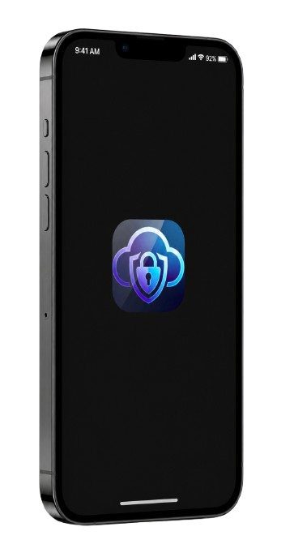
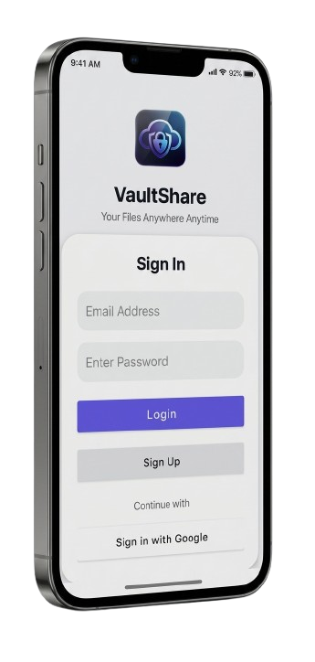
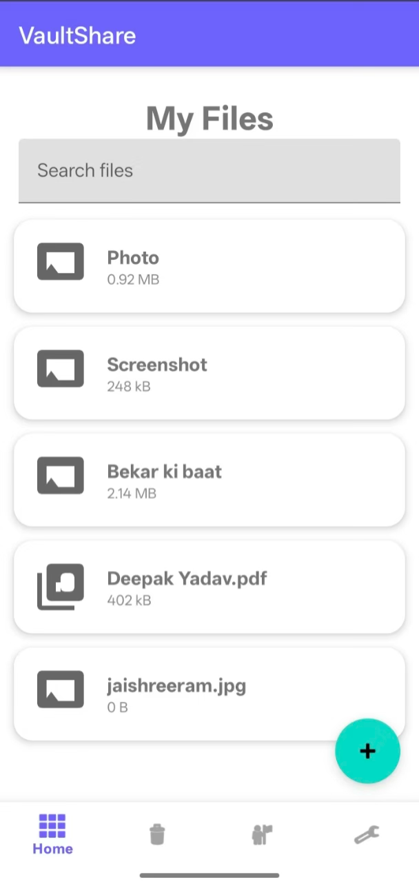
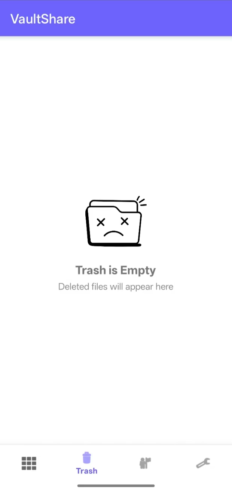
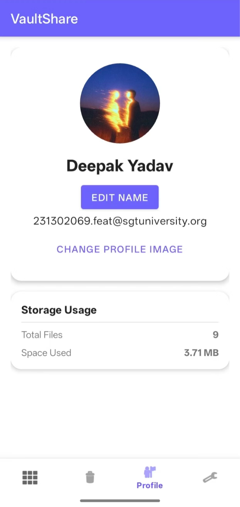
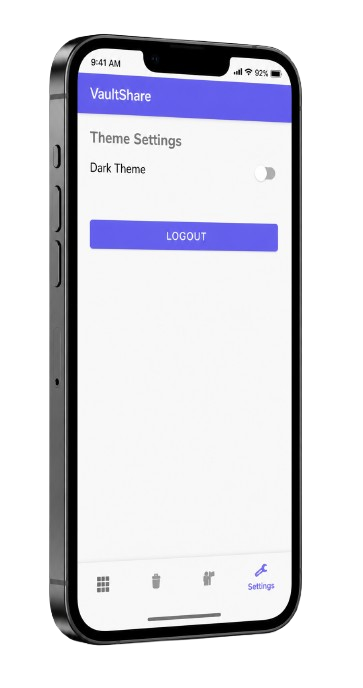

# CloudVault

CloudVault is a modern Android application for secure file storage, management, and sharing. It features Google authentication, file upload, trash management, and a customizable user profile. Built with Kotlin, Firebase, and Supabase, CloudVault offers a premium, user-friendly experience with a sleek UI and smooth animations.

## Features
- **Google Sign-In**: Secure authentication using Google accounts.
- **File Upload & Management**: Upload, view, and manage files (images, PDFs, and more).
- **Trash**: Move to trash, and restore or permanently delete.
- **Profile Customization**: Set a custom profile image and Edit user Name.
- **Search**: Instantly search files with a premium-feel search bar.
- **Modern UI**: Material Design, smooth RecyclerView animations, and dark mode support.
- **Notifications**: Welcome notification on login.

## Screenshots


## Technology Stack
- **Kotlin** (Android)
- **Firebase Authentication** (Google Sign-In)
- **Firebase Firestore** (File metadata storage)
- **Firebase Storage/Supabase** (File storage)
- **Material Components** (UI)
- **Glide** (Image loading)
- **ViewModel, LiveData, Coroutines** (Architecture)

## Setup & Installation
1. **Clone the repository**
   ```sh
   git clone https://github.com/Dinohelic/cloudvault.git
   cd cloudvault
   ```
2. **Open in Android Studio** (Giraffe or newer recommended)
3. **Configure Firebase**
   - Add your `google-services.json` to `app/`.
   - Set up Firebase project with Authentication (Google), Firestore, and Storage.
4. **Configure Supabase** (if used)
   - Add `SUPABASE_URL` and `SUPABASE_ANON_KEY` to `local.properties`.
5. **Build & Run**
   - Ensure Java 17 is set in your project settings.
   - Click Run ▶️ in Android Studio or use `./gradlew assembleDebug`.

## Usage Guide
- **Login**: Sign in with your Google account.
- **Home**: View all uploaded files. Use the search bar to filter files.
- **Upload**: Tap the FAB to upload new files. Only appears in Home.
- **Trash**: Deleted files go to Trash. Restore or permanently delete from here. Shows empty folder icon if no files.
- **Profile**: Set or change your profile image (per user). If not set, a default icon is shown.
- **Settings**: Toggle dark mode, log out.

## Contribution Guidelines
1. Fork the repository and create your branch.
2. Follow Kotlin and Android best practices.
3. Submit a pull request with a clear description of your changes.

## Troubleshooting & Common Issues
- **Resource Linking Errors**: Ensure all required icons and color resources exist in `res/drawable` and `res/values/colors.xml`.
- **Google Sign-In Issues**: Double-check your `google-services.json` and Firebase project configuration.
- **Profile Image Issues**: Profile images are stored per user using `profile_image_uri_{uid}` in SharedPreferences.
- **Java Version**: Project requires Java 17. Set it in Android Studio and Gradle.

## License
This project is licensed under the MIT License. See the [LICENSE](LICENSE) file for details.

---

*CloudVault – Secure, modern file management for Android.*
